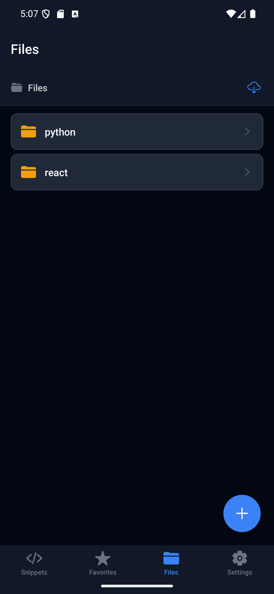

# DevSnippets AI

A modern developer-focused mobile application built with Expo, React Native, and TypeScript that allows users to save, organize, manage, and understand code snippets directly on their device. Follows an offline-first architecture — all core functionality works without an internet connection.

## Demo Video

[🎬 Watch Demo Video](assets/recording/recording%20dev%20snippets.webm)

## Screenshots

| Home                                          | Favorites                                         | Folder                                   | AI Usage                                       | Settings                                             |
| --------------------------------------------- | ------------------------------------------------- | ---------------------------------------- | ---------------------------------------------- | ---------------------------------------------------- |
|  |  |  |  |  |

## Features

- **Snippet Management** — Create, edit, delete, search, and favorite code snippets
- **Full-Text Search** — FTS5-powered search across titles, code, and tags
- **Offline Storage** — All data stored locally via SQLite; works without internet
- **File Manager** — Browse, create folders, move/copy files, download resources, and attach screenshots to snippets
- **Snippet–Folder Linking** — Link snippets to folders; auto-exports code files when saved. Folder badge shown on cards and detail view
- **Long-Press Actions** — Long-press snippet cards for quick Edit, Move to Folder, or Delete
- **AI Code Explanation** — Generate explanations, summaries, and improvement suggestions using Google Gemini
- **Export & Sharing** — Export snippets as `.txt`, `.js`, or `.json`; save directly to phone storage or share with other apps
- **Camera & Photo Attachments** — Attach screenshots from photo library or capture directly with camera
- **Theming** — Light, dark, and system theme modes
- **Clipboard Copy** — One-tap copy of code blocks

## Tech Stack

| Technology           | Usage                               |
| -------------------- | ----------------------------------- |
| Expo (SDK 56)        | App framework                       |
| React Native         | UI layer                            |
| TypeScript (strict)  | Type safety                         |
| expo-sqlite          | Snippet database (SQLite with FTS5) |
| AsyncStorage         | Theme and sort order preferences    |
| SecureStore          | Gemini API key storage              |
| Expo FileSystem      | Local file management               |
| Expo Router          | File-based navigation               |
| Expo ImagePicker     | Camera & photo library attachments  |
| Expo Sharing         | Share/export to other apps          |
| Google Generative AI | AI-powered code analysis            |

## Project Structure

```
app/
├── _layout.tsx              # Root layout (providers, navigation)
├── +not-found.tsx           # 404 screen
├── (tabs)/
│   ├── _layout.tsx          # Tab navigator
│   ├── index.tsx            # Home — snippet list
│   ├── favorites.tsx        # Favorites screen
│   ├── files.tsx            # File manager
│   └── settings.tsx         # Settings screen
└── snippet/
    ├── create.tsx           # Create snippet
    ├── [id].tsx             # Snippet detail / edit
    └── explain.tsx          # AI explanation

src/
├── components/
│   ├── CodeBlock.tsx        # Code display with copy
│   ├── EmptyState.tsx       # Empty list placeholder
│   ├── ExportModal.tsx      # Export format picker
│   ├── FileItemRow.tsx      # File list item
│   ├── SearchBar.tsx        # Search input
│   └── SnippetCard.tsx      # Snippet list card
├── constants/
│   └── index.ts             # Languages, keys, directories
├── context/
│   ├── DatabaseContext.tsx   # Snippet repository provider
│   └── ThemeContext.tsx      # Theme state provider
├── database/
│   ├── schema.ts            # Table creation & FTS5 setup
│   └── snippetRepository.ts # All CRUD operations
├── services/
│   ├── aiService.ts         # Gemini AI integration
│   ├── exportService.ts     # Export & share logic
│   └── fileService.ts       # File system operations
└── types/
    └── index.ts             # TypeScript interfaces
```

## Database Structure

SQLite database (`devsnippets.db`) with WAL journaling and foreign keys enabled.

### `snippets` table

| Column      | Type          | Description                                 |
| ----------- | ------------- | ------------------------------------------- |
| id          | INTEGER PK    | Auto-increment ID                           |
| title       | TEXT NOT NULL | Snippet title                               |
| code        | TEXT NOT NULL | Code content                                |
| language    | TEXT          | Programming language (default: `plaintext`) |
| tags        | TEXT          | JSON array of tag strings (default: `[]`)   |
| is_favorite | INTEGER       | 0 or 1 (default: 0)                         |
| folder_path | TEXT          | Linked folder path (default: NULL)          |
| created_at  | TEXT          | ISO timestamp                               |
| updated_at  | TEXT          | ISO timestamp                               |

### `attachments` table

| Column     | Type          | Description                                   |
| ---------- | ------------- | --------------------------------------------- |
| id         | INTEGER PK    | Auto-increment ID                             |
| snippet_id | INTEGER FK    | References `snippets(id)` with CASCADE delete |
| file_path  | TEXT NOT NULL | Local file path                               |
| file_name  | TEXT NOT NULL | Display name                                  |
| file_type  | TEXT          | File type (default: `image`)                  |
| created_at | TEXT          | ISO timestamp                                 |

### `snippets_fts` (FTS5 virtual table)

Full-text search index over `title`, `code`, and `tags` columns. Kept in sync via `AFTER INSERT`, `AFTER UPDATE`, and `AFTER DELETE` triggers on the `snippets` table.

## Offline Storage Approach

The app follows a **local-first architecture** — every operation reads from and writes to the on-device SQLite database. There are no remote API calls for data persistence.

- **SQLite** stores all snippets and attachments. FTS5 enables fast full-text search without a server.
- **AsyncStorage** persists lightweight user preferences (theme mode, sort order) as key-value pairs.
- **SecureStore** securely stores the Gemini API key using the platform's secure keychain/keystore.
- **Expo FileSystem** manages all local files under `documentDirectory`, organized into `attachments/`, `exports/`, and `files/` subdirectories.

The only feature requiring internet is **AI Code Explanation**, which calls the Gemini API. All other features — CRUD, search, favorites, file management, export — work fully offline.

## File Management Implementation

File management is built on top of `expo-file-system` and operates entirely within `documentDirectory`.

- **Directory structure** — Three app-managed directories are created on startup: `attachments/`, `exports/`, and `files/`.
- **Browse** — `readDirectoryAsync` lists folder contents; `getInfoAsync` provides metadata (size, modification time). Directories are sorted first, then alphabetically.
- **Create folders** — Users can create nested folders via a modal dialog.
- **Move & Copy** — A folder picker modal lets users select a destination. Uses `moveAsync` / `copyAsync`.
- **Delete** — Items are deleted with `deleteAsync` after user confirmation.
- **Download** — Users can download files from a URL using `downloadAsync`, saved to the current directory.
- **Screenshot attachments** — `expo-image-picker` lets users attach images to snippets via photo library or camera capture. Files are copied to `attachments/{snippetId}/` and tracked in the `attachments` table.
- **New Folder in pickers** — All folder picker modals include an inline "New Folder" button to create folders without leaving the picker.

## AI Integration Workflow

1. User navigates to a snippet's detail screen and taps the AI (lightbulb) button.
2. The AI Explanation screen opens with three action modes: **Explain**, **Summarize**, and **Improve**.
3. User selects an action and taps **Generate**.
4. The app retrieves the Gemini API key from `SecureStore`.
5. A tailored prompt is sent to `gemini-3.5-flash` via the `@google/generative-ai` SDK.
6. The response is displayed in a styled result box with selectable text.
7. Errors (missing key, invalid key, network failure) are caught and shown as user-friendly messages.

**API key management** is handled in the Settings screen — users can add or remove their key at any time. The key is never stored in plaintext or transmitted outside the Gemini API call.

## Bonus Features

- **FTS5 full-text search** — Instant search across snippet titles, code, and tags using SQLite's FTS5 engine with automatic sync triggers
- **Clipboard copy** — One-tap copy button on code blocks via `expo-clipboard`
- **Configurable sort order** — Sort snippets by recently updated, recently created, title A-Z, or oldest first
- **Download manager** — Download files from URLs directly into the file manager
- **Move/Copy with folder picker** — Visual folder navigation to pick a destination for move/copy operations
- **Snippet–Folder linking** — Link snippets to folders with auto-export; folder badges shown on snippet cards and detail view
- **Long-press quick actions** — Long-press snippet cards on Home and Favorites for Edit, Move to Folder, or Delete
- **Save to Phone** — Export files directly to the device's file system using Android StorageAccessFramework or iOS share sheet
- **Inline folder creation** — Create new folders without leaving folder picker modals
- **Camera capture** — Take photos directly from the camera to attach to snippets

## Getting Started

```bash
# Install dependencies
npm install

# Start the development server
npx expo start

# Run on Android
npx expo run:android

# Run on iOS
npx expo run:ios
```

### Gemini API Key Setup

1. Go to [Google AI Studio](https://aistudio.google.com) and create a free API key
2. Open the app → Settings → AI Configuration → tap the + button
3. Paste your key and save — it is stored securely via `expo-secure-store`

## License

See [LICENSE](LICENSE) for details.
